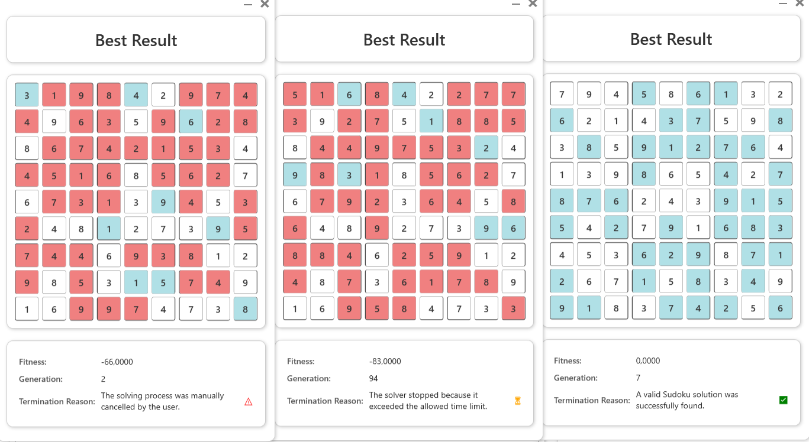

<p align="center">
  
</p>

# 🧬 Genetic Algorithms Sudoku Solver
<p align="center">
  
  
  
</p>

This project implements a **Sudoku solver** based on a **genetic algorithms**. Unlike traditional methods that use backtracking or constraint propagation, our approach mimics the process of natural selection to evolve potential solutions across generations.

The application allows for **modular customization** of key components of the genetic algorithms, including:

- **Representation**
- **Fitness Function**
- **Selection**
- **Crossover**
- **Mutation**
  
The project was developed as part of the _Introduction to Artificial Intelligence_ course during the summer semester of the 2024–2025 academic year.

## 📘 Table of Contents

1. [🧬 Overview](#-genetic-algorithms-sudoku-solver)
2. [🎯 Features](#-features)
3. [📊 Examples & Results](#-examples--results)
4. [📦 Installation](#-installation)
5. [🚀 Technologies Used](#-technologies-used)
6. [🤝 Authors](#-authors)


## 🎯 Features

Our application offers a rich set of features that make experimentation with genetic algorithms both informative and interactive:
> 👇 **Click on any feature below to see it in action**
<details>
<summary>
✅ <strong>Modular algorithm components</strong> – customize selection, crossover, mutation, representation, and fitness functions.
</summary>
<p align="center">
  
</p>
</details>

<details>
<summary>
🔢 <strong>Sudoku input from CSV files</strong> – run the solver on any valid 9x9 puzzle loaded from a `.csv` file.
</summary>
<p align="center">
  
</p>
</details>

<details>
<summary>
🎲 <strong>Random initial population</strong> – generate a population of a specified size for experimentation.
</summary>
<p align="center">
  
</p>
</details>

<details>
<summary>
📈 <strong>Real-time fitness chart with interactive best individual display</strong> – watch the best solution evolve live, with ability to view the most fit solution in each generation.
</summary>
<p align="center">
  
</p>
</details>

<details>
<summary>
⏱️ <strong>Execution time measurement</strong> – automatically measure and display the algorithm’s runtime.
</summary>
<p align="center">
  
</p>
</details>

<details>
<summary>
🛑 <strong>Interrupt functionality</strong> – manually stop the algorithm at any moment.
</summary>
<p align="center">
  
</p>
</details>

<details>
<summary>
📤 <strong>Output error analysis</strong> – compare the final solution to the exact one and highlight incorrect values.
</summary>
<p align="center">
  
</p>
</details>

## 📊 Examples & Results

Our genetic algorithm solver has been tested on various difficulty levels:
- Easy
- Medium
- Hard
- Expert
- Master
- Extreme

### 📊Example 1:

| Difficulty | Solved | Average Generations | Average Time |
|------------|--------|---------------------|--------------|
| Easy       |✅     | ~12                 | 0.1 seconds  |
| Medium     |✅     | ~23                 | 0.2 seconds  |
| Hard       |❌     | -                   | - |

<details>
  <summary>
    ⚙️ Settings
  </summary>
  
 ```
Population size: 10000
Parent per generation: 100
Maximum generations: 1000
Representation: Candidat Choice
Fitness function: Equally Punished Conflict
Selection: Tournament Selection, size = 40
Crossover: K-Point Crossover, K = 2
Mutation: Percent Chance, chance = 20%
```
</details>

### 📊Example 2:
| Difficulty | Solved | Average Generations | Average Time |
|------------|--------|---------------------|--------------|
| Easy       |✅     | ~6                  | 1 second     |
| Medium     |✅     | ~10                 | 1.5 seconds  |
| Hard       |✅/❌  |~30                  | 5 seconds    |
| Expert      |❌  |-                      | -            |
<details>
  <summary>
    ⚙️ Settings
  </summary>
  
 ```
Population size: 100000
Parent per generation: 2000
Maximum generations: 1000
Representation: Candidat Choice
Fitness function: Rising Conflict
Selection: Rank Selection
Crossover: K-Point Crossover, K = 5
Mutation: Percent Chance, chance = 4%
```
</details>

## 📦 Installation

To run the project locally:

1. **Clone the repository:**

```bash
git clone https://github.com/adamgracikowski/GASudokuSolver.git
cd GASudokuSolver
```

2. **Restore NuGet packages:**

```bash
dotnet restore
```

3. **Build and run the application:**

```bash
dotnet run --project GASudokuSolver.GUI
```

You can also open the solution in Visual Studio (recommended: 2022 or newer) and press `F5`.

## 🚀 Technologies Used

- **C#** – core programming language.
- **WPF (Windows Presentation Foundation)** – desktop UI framework.

The solution consists of the following projects:

- `GASudokuSolver.Core` - .NET class library containing:
  - Algorithm modules (selection, crossover, mutation, representation, fitness evaluation).
  - Data loading components (CSV input, puzzle representation).
  - Solver logic.
- `GASudokuSolver.GUI` – WPF application providing:
  - Graphical interface for loading puzzles and configuring algorithm parameters.
  - Live display of best individual and fitness chart.
  - Controls for start/stop and execution time measurement.

## 🤝 Authors

This project was created by:

- **Marcin Cieszyński** – [@Zumi002](https://github.com/Zumi002)
- **Adam Grącikowski** – [@adamgracikowski](https://github.com/adamgracikowski)
